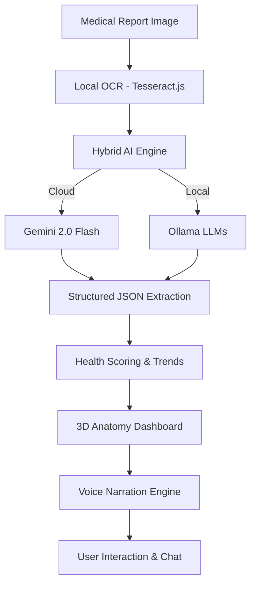

Alright. I’ll generate a **full README in the same spirit, depth, and structure** as the ThreatShield one, but tailored to **your Medical Analyzer**.
You can directly paste this into GitHub. I’ll keep it **serious, competitive, and product-grade**.

You can rename anything later.

---

# 🧠 MediScan AI – Privacy-First Medical Report Intelligence Platform

# DATAQUEST / Hackathon Edition

<div align="center">


**🏥 AI-Powered Medical Report Analyzer & Accessibility Dashboard**

[](#)
[](#)
[](#)
[](#)

*Turning complex medical reports into clear, visual, and narratable health stories*

</div>

---

## 👥 Team <YOUR_TEAM_NAME>

<table align="center">
<tr>
<td align="center"></td>
<td align="center"></td>
<td align="center"></td>
<td align="center"></td>
</tr>
</table>

---

## 🎯 Problem Statement

Medical reports are written **for clinicians**, not for patients.

### 🔍 The Challenge

* Patients struggle to understand lab values and medical terminology
* Elderly and visually impaired users are excluded from digital health tools
* Existing AI tools are text-centric and cloud-dependent
* Lack of context, trends, and explainability increases anxiety

---

## 🚀 Our Solution: MediScan AI

MediScan AI is a **privacy-first, accessibility-driven medical report intelligence platform** that converts scanned reports into **structured insights, interactive visuals, voice explanations, and historical health trends**.

It works **with or without the cloud**, supports **voice-only navigation**, and is designed so **blind and elderly users can use it independently**.

<div align="center">



</div>

---

## ⭐ Key Features

### 🔒 Privacy-First Medical Intelligence

* **100% local OCR** using Tesseract.js
* Optional **local AI processing** via Ollama
* No forced cloud dependency
* User-controlled data persistence

---

### 🧠 Structured Medical Understanding

* Precise extraction of lab values into JSON
* Clinical range comparison
* Abnormal value highlighting
* Confidence-aware extraction (High / Medium / Low)

---

### 🫀 Interactive 3D Anatomy Dashboard

* Touch-based body system exploration
* Organ-specific lab value mapping
* Color-coded health indicators
* Click-to-hear explanations

---

### 📊 Smart Health Scoring

* Algorithmic health percentage per system
* Weighted scoring based on reference ranges
* Change-aware scoring across reports
* Transparent “Explain Why” logic

---

### 📈 Historical Trend Tracking

* Persistent health history via Firebase
* Visual trend graphs for key metrics
* Delta-based narration:

  * “Improved”
  * “Worsened”
  * “Stable”

---

### 🎙️ Accessibility-First Experience

* Auto-narration of results
* Voice-only navigation mode
* Adjustable speech rate
* Text scaling up to large print
* High-contrast UI with large touch targets

---

### 💬 Context-Aware AI Chat

* Ask questions about your own report
* AI remembers extracted values
* Non-diagnostic, educational responses
* Guardrails against medical advice

---

## 🏗️ System Architecture

```
┌──────────────────────┐
│   Frontend (React)   │
│  Framer Motion + UX  │
└─────────┬────────────┘
          │
┌─────────▼────────────┐
│   Local OCR Engine   │
│   (Tesseract.js)     │
└─────────┬────────────┘
          │
┌─────────▼────────────┐
│   Hybrid AI Layer    │
│ Gemini | Ollama LLM  │
└─────────┬────────────┘
          │
┌─────────▼────────────┐
│ Structured Analysis  │
│ Trends | Scores | QA │
└─────────┬────────────┘
          │
┌─────────▼────────────┐
│ Visualization Layer  │
│ Anatomy | Charts     │
└─────────┬────────────┘
          │
┌─────────▼────────────┐
│ Voice & Accessibility│
│ Web Speech API       │
└──────────────────────┘
```

---

## 🛠️ Technology Stack

<div align="center">

### Frontend


### AI & Intelligence


### OCR & Voice


### Backend & Storage


</div>

---

## 🔐 Ethics & Safety

* Non-diagnostic system
* No medication recommendations
* Clear confidence indicators
* Explainable AI decisions
* User-controlled data deletion

---

## 🚀 Getting Started

### Prerequisites

```bash
Node.js 18+
npm or pnpm
Ollama (optional, for local AI)
```

### Installation

```bash
git clone https://github.com/<your-org>/mediscan-ai.git
cd mediscan-ai
npm install
npm run dev
```

---

## 🎯 Use Cases

* Elderly patients reviewing lab reports
* Visually impaired users accessing health data
* Families tracking long-term health trends
* Clinics needing patient-friendly summaries
* Privacy-conscious individuals

---

## 🔮 Roadmap

### Phase 2

* Multilingual voice narration
* Clinical guideline mapping
* Caregiver access mode

### Phase 3

* Federated learning (privacy-safe)
* Doctor-ready summaries
* Device-agnostic deployment

---

## 🏆 Innovation Highlights

* Hybrid cloud + local AI
* Voice-only navigation
* Interactive anatomy intelligence
* Confidence-aware medical extraction
* Accessibility-first architecture

---

<div align="center">


</div>

---

> *“Healthcare intelligence should be understandable, inclusive, and private by default.”*
> **— Team <YOUR_TEAM_NAME>**

---

If you want next, I can:

* Add **API docs section**
* Add **evaluation metrics**
* Tune this to sound **more clinical or more startup**
* Strip it down for a **hackathon-only README**

Just tell me which direction.
